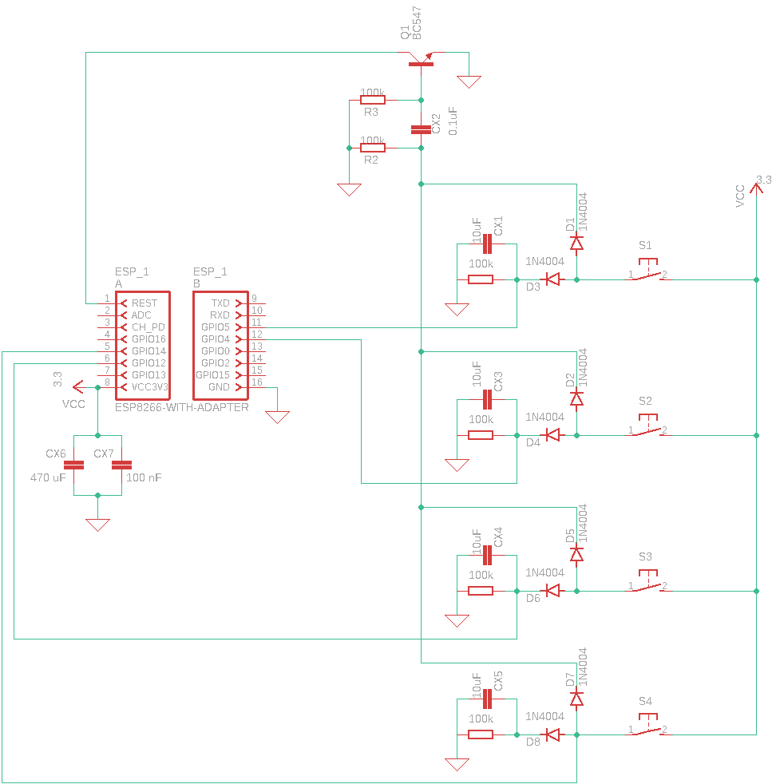

# Multi Wifi Switch - Battery

The multi wifi switch is based on a plain ESP 12F chip. It sends button presses over MQTT to a broker. The box has *4 buttons* and *1 LED* and is relativly dumb.  It relies on an external controller (like [Home Assistant](https://www.home-assistant.io/), [IoBroker](https://www.iobroker.net/), ...) for intrepetting the button presses.

## Battery lifetime

The ESP is most of the time in deep sleep. It only wakes up, when a button is pressed. In deep sleep the circuit needs only arround *17 µA*. The time needed for waking up, connecting to the wifi, connecting to the MQTT broker and going back to sleep is for my setup between 0,75 - 3 seconds. While it is up and sending data the circuit consumes on average arround *100 mA*.

So, pressing a button needs

* at best `0,75 s * 100 mA = 75 mAs = 0,02 mAh`
* at worst `3 s * 100 mA = 300 mAs = 0,08 mAh`

Sleeping a whole day without pressing any buttons needs

`24 h * 0,017 mA = 0,4 mAh`

A typical LiFePo4 18650 battery has `1500 mAh`. If we assume there are 10 button presses every day, we need in the worst case `10 * 0,08 mAh = 0,8 mAh`. The rest of the day, the device is in deep sleeps which consumes approximately `0,4 mAh`. In total `0,8 mAh + 0,4 mAh = 1,2 mAh` is needed . With a full charge of the battery it will last arround `1500 mAh / 1,2 mAh = 1250 days = 3,4 years`. Pressing the button more often will drastically decrease runtime.

## Buttons

Every button can distinguish between two button presses:

* Short press
* Long press (Press as long as the LED is on, to ensure a long press is recognized)

## LED

The LED is on, while the ESP is active. As soon as it is off again, the data is sent. If no wifi connection was possible it will blink 5 times slowly. Blinking 10 times fastly means no connection to the MQTT broker could be established.

## Wifi and MQTT configuration

I don't like to share my wifi password with why there is a [`Secretes_dummy.h`](src/../Secrets_dummy.h) file. Fill in your configuration and rename this file to `Secrets.h`. The [`.gitignore`](.gitignore) will prevent checking in this file.

## Circuit

The circuit needs a voltage arround 3.3 volts. I use a LiFePo4 battery, because it already has the desired voltage and no voltage conversion is needed.

